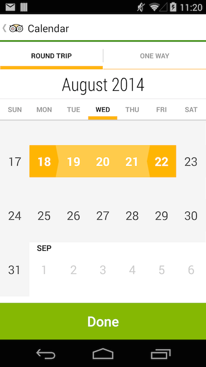

TripAdvisor Android CalendarView 
================================
[](https://travis-ci.org/Kurry/android-calendarview)

A standalone Android widget for picking a single date or range from a calendar view. 


<br/>


Download
--------

The latest version can be downloaded in [zip][zip] and referenced by your application as a library
project.

Usage
-----

Can be built with API level 8+, but was tested against API level 14+.

Include `CalendarView` in your layout XML.

```xml
<com.tripadvisor.CalendarView
    android:id="@+id/calendar_view"
    android:layout_width="match_parent"
    android:layout_height="match_parent"/>
```

In the `onCreate` of your activity/dialog or the `onCreateView` of your fragment, initialize the
view with a range of valid dates as well as the currently selected date.

```java
Calendar nextYear = Calendar.getInstance();
nextYear.add(Calendar.YEAR, 1);

CalendarView calendar = (CalendarView) findViewById(R.id.calendar_view);
Date today = new Date();
calendar.init(today, nextYear.getTime())
    .withSelectedDate(today);
```

The default mode of the view is to have one selectable date.
If you want the user to be able to select multiple dates or 
a date range, use the inMode() method:

```java
calendar.init(today, nextYear.getTime())
    .inMode(RANGE);
```

License
--------

    Copyright 2014 TripAdvisor, Inc.

    Licensed under the Apache License, Version 2.0 (the "License");
    you may not use this file except in compliance with the License.
    You may obtain a copy of the License at

       http://www.apache.org/licenses/LICENSE-2.0

    Unless required by applicable law or agreed to in writing, software
    distributed under the License is distributed on an "AS IS" BASIS,
    WITHOUT WARRANTIES OR CONDITIONS OF ANY KIND, either express or implied.
    See the License for the specific language governing permissions and
    limitations under the License.

Inspiration
-----------

https://github.com/SimonVT/android-calendarview <br/>
https://github.com/square/android-times-square

[zip]: https://github.com/TripAdvisor/android-calendarview/archive/master.zip